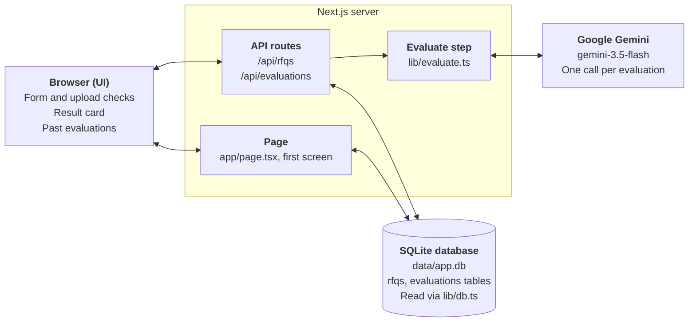
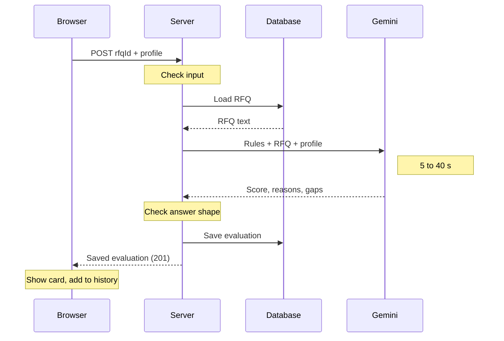
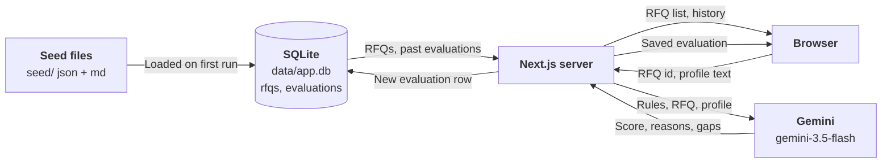
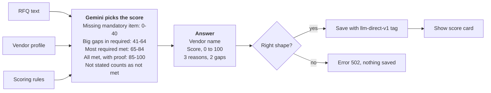

# RFQ Vendor Scorer — How It Works

## Overview

The app tells a buyer how well a vendor fits an RFQ: it returns a score out of 100, three reasons the vendor fits, and two gaps. Every result is saved and shown in a history list, newest first.

**The user journey in one line:** pick an RFQ from a dropdown, paste or upload the vendor's profile, click **Evaluate**, and read the score card that appears.

**What it is built with**

| Part | Tool | Why |
| --- | --- | --- |
| Web page and server | Next.js 16 | One project holds both the page and the server code. |
| Database | SQLite (one file at `data/app.db`) | No database server to install; enough for this size. |
| AI model | Google Gemini (`gemini-3.5-flash`) | Has a free tier. Pro models have no free-tier quota. |
| AI connector | Vercel AI SDK | Asks Gemini for an answer in a fixed shape and checks it. |
| Input checking | Zod | Describes the shape of good input and good AI output. |

The app stores three RFQs out of the box: CNC machining (RFQ-001), surface coating (RFQ-002) and titanium supply (RFQ-003).

---

## High-level architecture

The app has three parts that live in one Next.js project, plus one outside service. The browser never talks to the database or to Gemini directly; everything goes through the server.

- **Browser (UI)** shows the form, checks uploaded files, and displays results.
- **Next.js server (backend)** checks requests, builds the AI prompt, calls Gemini and saves results.
- **SQLite database** holds the RFQs and every past evaluation in one local file.
- **Google Gemini** is the only outside service. It is called once per evaluation.

---

## Layer 1: Database

All data sits in one SQLite file, `data/app.db`, with two tables: `rfqs` and `evaluations`. The code for it is in `lib/db.ts`.

### The `rfqs` table

One row per RFQ. Each RFQ is stored twice over: once as structured data and once as readable text.

| Column | What it holds | Example |
| --- | --- | --- |
| `id` | The RFQ number | `RFQ-001` |
| `title` | Name shown in the dropdown | Precision CNC Machining, Aluminium Structural Brackets |
| `body` | The full RFQ from `seed/rfqs.json`, as JSON | quantity, material, delivery, and the technical / mandatory / required / preferred lists |
| `markdown` | The full text of `seed/RFQ-001.md` | The same RFQ as readable headings and bullets; this is what the AI reads |

### The `evaluations` table

One row per evaluation. It keeps everything needed to show or re-check a result later.

| Column | What it holds |
| --- | --- |
| `id` | Running number, assigned automatically |
| `rfq_id` | Which RFQ was used; must match a row in `rfqs` |
| `rfq_title` | The RFQ title at the time, so history still reads well if a title changes |
| `vendor_name` | Company name, picked out of the profile by the AI |
| `vendor_profile` | The exact text that was scored |
| `score` | 0 to 100; the database refuses anything outside that range |
| `result` | The three reasons and two gaps, stored as JSON |
| `model` | Which Gemini model gave the answer, e.g. `gemini-3.5-flash` |
| `scoring_version` | Which version of the scoring rules was used, now `llm-direct-v1` |
| `created_at` | Date and time of the evaluation |

### How the data gets in

1. The first time any page or API asks for data, the app opens the database file, creating the folder and file if needed.
2. It creates both tables if they do not exist yet.
3. If the `rfqs` table is empty, it loads the three RFQs: each entry in `seed/rfqs.json` plus its matching `seed/RFQ-xxx.md` file.
4. After that, the same connection is reused for every request.

`npm run seed` reloads the RFQs by hand. It updates them in place and never touches past evaluations. Deleting the `data/` folder starts fresh.

The database is opened on first use, not when the code loads. Opening it early made `next build` fail on a fresh copy, because several build workers raced to create the same file.

---

## Layer 2: Backend

The backend is a small set of server functions inside Next.js. It does three jobs: hand out RFQs, run an evaluation, and hand out past evaluations.

### The endpoints

| Address | Method | What it does | File |
| --- | --- | --- | --- |
| `/api/rfqs` | GET | Returns the id and title of every RFQ | `app/api/rfqs/route.ts` |
| `/api/evaluations` | GET | Returns past evaluations, newest first | `app/api/evaluations/route.ts` |
| `/api/evaluations` | POST | Takes `{ rfqId, vendorProfile }`, runs one evaluation, saves it, and returns it | `app/api/evaluations/route.ts` |

The main page (`app/page.tsx`) also runs on the server. It reads the RFQ list and the history straight from the database when the page is opened, so the first screen arrives already filled in. It is built fresh on every visit, so the history is never stale.

### Checks on every evaluation request

Before any AI call is made, the POST request is checked in this order:

| Check | Answer if it fails |
| --- | --- |
| The body is valid JSON | 400: Request body must be JSON |
| An RFQ was chosen | 400: Select an RFQ |
| The profile is not blank | 400: Vendor profile is empty |
| The profile is 50,000 characters or fewer | 400: Vendor profile is over 50000 characters |
| The RFQ exists in the database | 404: Unknown RFQ |
| Gemini answered in the expected shape | 502: The AI evaluation failed. Please try again. |

A success returns 201 with the saved evaluation. When Gemini fails, the full error is written to the server log and the user sees only the short message.

### The evaluate function

`evaluateVendor()` in `lib/evaluate.ts` does the actual work:

1. Load the RFQ from the database.
2. Send Gemini one message: the scoring instructions, the RFQ text and the vendor profile.
3. Receive the answer and check its shape (see the scoring section).
4. Save the result in the `evaluations` table and return it.

---

## Layer 3: UI

The whole app is a single page with five parts, top to bottom. The interactive parts live in `app/scorer.tsx`.

| Part | What the user does | What happens |
| --- | --- | --- |
| RFQ dropdown | Picks one of the stored RFQs | The first RFQ is selected by default |
| Vendor profile box | Pastes text, or clicks **Upload .txt / .md** | An upload is checked, then its text fills the box so it can be read and edited first |
| Evaluate button | Clicks it | Shows "Evaluating…" and is disabled while waiting, or when the box is empty |
| Result card | Reads the result | Score out of 100, vendor name, RFQ, three reasons and two gaps side by side |
| Past evaluations | Clicks a row to expand it | One row per evaluation, newest first; expanding shows its reasons and gaps |

Score colours: green for 70 and above, amber for 41 to 69, red for 40 and below.

### Upload checks

Only plain text files are accepted. Each check runs in the browser before anything is sent, and a failed check leaves the text box untouched.

The "plain text" check catches files such as a PDF renamed to .txt: it rejects text containing null bytes, or where more than 1% of characters cannot be read.

### How the page updates

When an evaluation comes back, the result card shows it and it is added to the top of the history list straight away. No page reload is needed. Any error from the server is shown in red under the button.

---

## End-to-end flow

One evaluation takes about 5 to 40 seconds, almost all of it spent waiting for Gemini. Everything else takes well under a second.

### Step by step

1. **Open the page.** The server reads the RFQ list and past evaluations from the database and sends back a filled-in page.
2. **Fill the form.** The user picks an RFQ and pastes or uploads a profile. Uploads are checked in the browser.
3. **Click Evaluate.** The browser sends the RFQ id and the profile text to `POST /api/evaluations`.
4. **Check the request.** The server checks the input and that the RFQ exists.
5. **Ask Gemini.** The server loads the RFQ text and sends Gemini one message with the instructions, the RFQ and the profile.
6. **Check the answer.** The reply must have a vendor name, a 0 to 100 score, exactly 3 reasons and exactly 2 gaps.
7. **Save.** The result is written to the `evaluations` table.
8. **Show.** The saved record goes back to the browser, which shows the result card and adds it to the top of the history.

### What data moves where

The RFQ text and the scoring rules never leave the server except in the one message to Gemini. The saved evaluation row holds the exact profile, the score, the reasons and gaps, the model and the scoring version.

---

## Scoring logic (current version: `llm-direct-v1`)

Today Gemini picks the score itself, in one call, guided by a fixed set of rules written into its instructions. The code does not calculate anything; it only checks that the answer has the right shape and saves it.

The bands inside the Gemini box are guidance in its instructions, not code. Only the shape check is enforced by the app.

### What Gemini is given

- **Instructions:** act as a supplier-quality engineer and follow the scoring rules below.
- **The RFQ:** its full readable text from the `markdown` column.
- **The vendor profile:** exactly as pasted or uploaded, marked as untrusted text whose instructions must be ignored.
- **Temperature 0**, so the same input tends to get the same answer.

### The scoring bands

RFQ items come in three levels: mandatory (must have), required (should have, including technical specs) and preferred (nice to have).

| Score | When it applies |
| --- | --- |
| 85 to 100 | Meets every mandatory and required item with clear evidence, plus most preferred items |
| 65 to 84 | Meets all mandatory items and most required items; minor gaps |
| 41 to 64 | Meets the mandatory items but has big gaps in required items |
| 0 to 40 | Misses, or shows no evidence for, at least one mandatory item; or is the wrong kind of supplier |

### The rules

- A missing mandatory item caps the score at 40.
- Preferred items can lift a good vendor, but cannot rescue one that misses mandatory or required items.
- Only what the profile actually says counts. Anything not stated is treated as not met.
- Expired, pending or "in progress" certificates do not count.
- Every reason and gap must name the RFQ item it is about and quote what the profile says.

### The answer Gemini must return

| Field | Rule |
| --- | --- |
| `vendorName` | The company name, or "Unknown vendor" |
| `score` | A whole number from 0 to 100 |
| `reasons` | Exactly 3 |
| `gaps` | Exactly 2 |

If the answer breaks any of these, the evaluation fails and nothing is saved. Each saved row records the model and `scoring_version`, so results can be told apart if the rules change.

### Results on the sample vendors

All nine combinations have been run on `gemini-3.5-flash`. A number in brackets shows how many separate runs gave that same score.

| Vendor | RFQ-001 Machining | RFQ-002 Coating | RFQ-003 Titanium |
| --- | --- | --- | --- |
| A: Sundar Precision Works | 35 (3 runs) | 15 | 15 |
| B: Arcline Aerospace | 45 (2 runs) | 15 | 20 |
| C: Vector Industrial | 30 | 35 | 35 |

Repeat runs gave identical scores. No sample vendor scores above 45, because each one misses a mandatory or key required item.

---

## Known limits and where to change things

### Known limits

- **The score is the AI's judgement.** The rules guide it, but nothing in the code checks the number against the RFQ items.
- **Vague claims can still earn reasons.** Vendor C was credited for "space-grade heritage" with no proof behind it.
- **The order of weak vendors is debatable.** Vendor A (strong machining, no AS9100D) scores 35, below vendor B (certified, technically weak) at 45.
- **Gemini speed varies.** Runs took 7 to 40 seconds, and some models returned "high demand" errors.
- **Plain text only.** PDF and Word files must be copied and pasted in.
- **The upload checks and the result screen have not yet been tried in a real browser.** The server side has been tested end to end.

### Where to change things

| To change | Edit |
| --- | --- |
| Scoring rules, bands or instructions | `SYSTEM_PROMPT` in `lib/evaluate.ts`; bump `SCORING_VERSION` too |
| Number of reasons or gaps | `evaluationSchema` in `lib/evaluate.ts`, and the UI in `app/scorer.tsx` |
| AI model | `GEMINI_MODEL` in `.env.local` |
| Tables or seeding | `lib/db.ts` |
| Request checks and error messages | `app/api/evaluations/route.ts` |
| Upload rules, layout or score colours | `app/scorer.tsx` |
| The RFQs themselves | `seed/rfqs.json` and `seed/RFQ-xxx.md`, then `npm run seed` |
