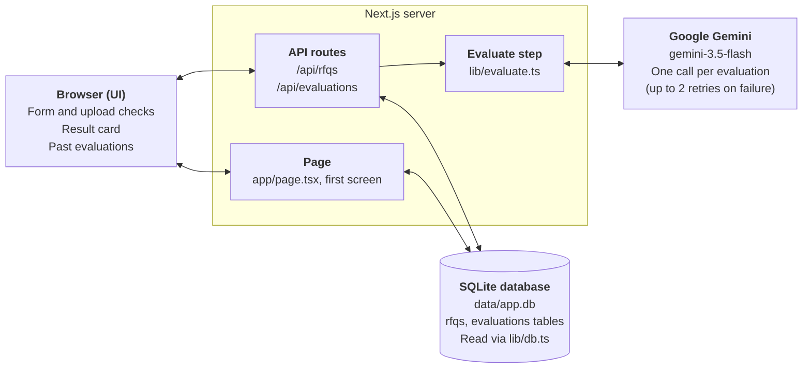
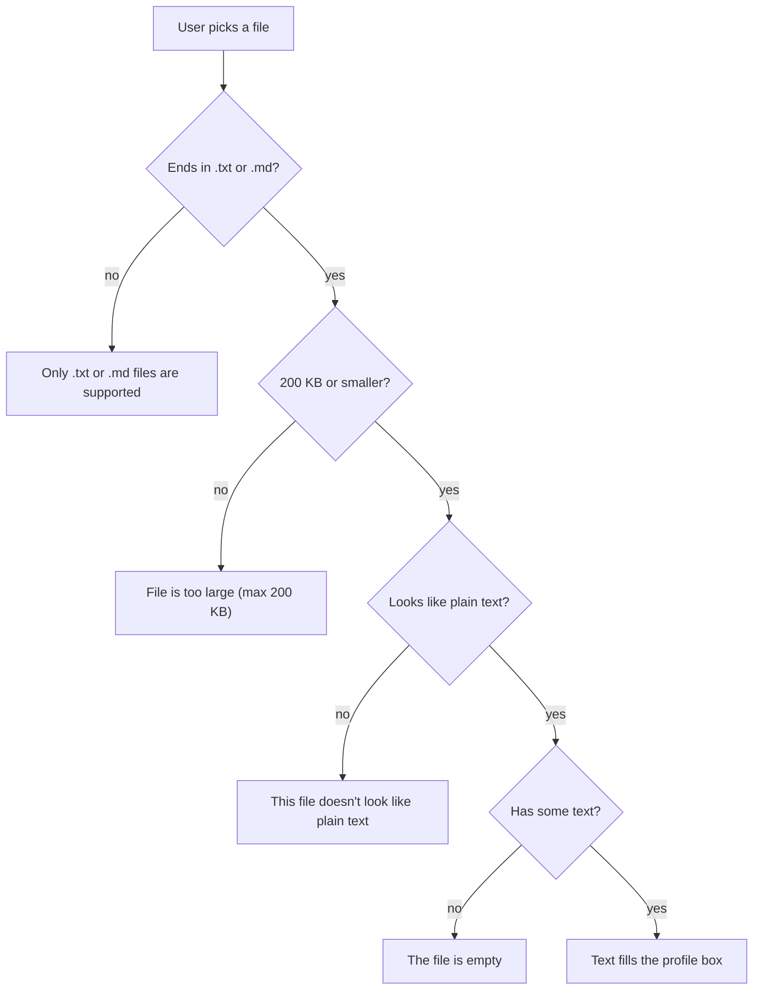
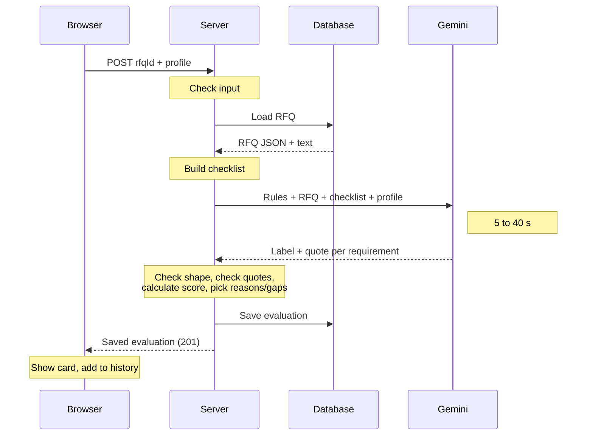
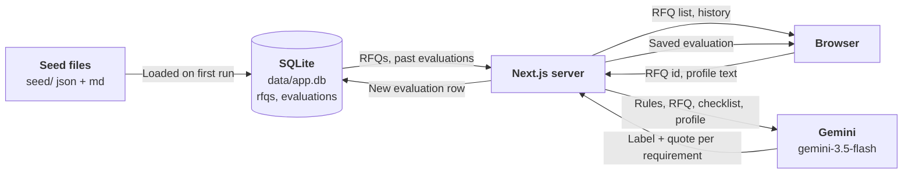
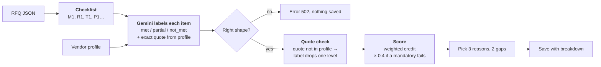

# RFQ Vendor Scorer — How It Works

## Overview

The app tells a buyer how well a vendor fits an RFQ: it returns a score out of 100, three reasons the vendor fits, and two gaps. Every result is saved and shown in a history list, newest first.

**The user journey in one line:** pick an RFQ from a dropdown, paste or upload the vendor's profile, click **Evaluate**, and read the score card that appears.

**What it is built with**

| Part | Tool | Why |
| --- | --- | --- |
| Web page and server | Next.js 16 | One project holds both the page and the server code. |
| Database | SQLite (one file at `data/app.db`) | No database server to install; enough for this size. |
| AI model | Google Gemini (`gemini-3.5-flash`) | Has a free tier. Pro models have no free-tier quota. |
| AI connector | Vercel AI SDK | Asks Gemini for an answer in a fixed shape and checks it. |
| Input checking | Zod | Describes the shape of good input and good AI output. |

The app stores three RFQs out of the box: CNC machining (RFQ-001), surface coating (RFQ-002) and titanium supply (RFQ-003).

---

## High-level architecture

The app has three parts that live in one Next.js project, plus one outside service. The browser never talks to the database or to Gemini directly; everything goes through the server.



- **Browser (UI)** shows the form, checks uploaded files, and displays results.
- **Next.js server (backend)** checks requests, builds the AI prompt, calls Gemini and saves results.
- **SQLite database** holds the RFQs and every past evaluation in one local file.
- **Google Gemini** is the only outside service. It is called once per evaluation (the AI SDK retries up to 2 times on failure).

---

## Layer 1: Database

All data sits in one SQLite file, `data/app.db`, with two tables: `rfqs` and `evaluations`. The code for it is in `lib/db.ts`.

### The `rfqs` table

One row per RFQ. Each RFQ is stored twice over: once as structured data and once as readable text.

| Column | What it holds | Example |
| --- | --- | --- |
| `id` | The RFQ number | `RFQ-001` |
| `title` | Name shown in the dropdown | Precision CNC Machining, Aluminium Structural Brackets |
| `body` | The full RFQ from `seed/rfqs.json`, as JSON | quantity, material, delivery, and the technical / mandatory / required / preferred lists |
| `markdown` | The full text of `seed/RFQ-001.md` | The same RFQ as readable headings and bullets; the AI reads this together with the checklist built from `body` |

### The `evaluations` table

One row per evaluation. It keeps everything needed to show or re-check a result later.

| Column | What it holds |
| --- | --- |
| `id` | Running number, assigned automatically |
| `rfq_id` | Which RFQ was used; must match a row in `rfqs` |
| `rfq_title` | The RFQ title at the time, so history still reads well if a title changes |
| `vendor_name` | Company name, picked out of the profile by the AI |
| `vendor_profile` | The exact text that was scored |
| `score` | 0 to 100; the database refuses anything outside that range |
| `result` | JSON: the three reasons, the two gaps, and the per-requirement breakdown (label, quote, whether the quote was found) |
| `model` | Which Gemini model gave the answer, e.g. `gemini-3.5-flash` |
| `scoring_version` | Which version of the scoring rules was used, now `llm-hybrid-v2` (older rows: `llm-direct-v1`, which have no breakdown) |
| `created_at` | Date and time of the evaluation |

### How the data gets in

1. The first time any page or API asks for data, the app opens the database file, creating the folder and file if needed.
2. It creates both tables if they do not exist yet.
3. If the `rfqs` table is empty, it loads the three RFQs: each entry in `seed/rfqs.json` plus its matching `seed/RFQ-xxx.md` file.
4. After that, the same connection is reused for every request.

`npm run seed` reloads the RFQs by hand. It updates them in place and never touches past evaluations. Deleting the `data/` folder starts fresh.

The database is opened on first use, not when the code loads. Opening it early made `next build` fail on a fresh copy, because several build workers raced to create the same file.

---

## Layer 2: Backend

The backend is a small set of server functions inside Next.js. It does three jobs: hand out RFQs, run an evaluation, and hand out past evaluations.

### The endpoints

| Address | Method | What it does | File |
| --- | --- | --- | --- |
| `/api/rfqs` | GET | Returns the id and title of every RFQ | `app/api/rfqs/route.ts` |
| `/api/evaluations` | GET | Returns the latest 50 evaluations, newest first | `app/api/evaluations/route.ts` |
| `/api/evaluations` | POST | Takes `{ rfqId, vendorProfile }`, runs one evaluation, saves it, and returns it | `app/api/evaluations/route.ts` |

The main page (`app/page.tsx`) also runs on the server. It reads the RFQ list and the history straight from the database when the page is opened, so the first screen arrives already filled in. It is built fresh on every visit, so the history is never stale.

### Checks on every evaluation request

The POST request is checked in this order:

| Check | Answer if it fails |
| --- | --- |
| The body is valid JSON | 400: Request body must be JSON |
| An RFQ was chosen | 400: Select an RFQ |
| The profile is not blank | 400: Vendor profile is empty |
| The profile is 50,000 characters or fewer | 400: Vendor profile is over 50000 characters |
| The RFQ exists in the database | 404: Unknown RFQ |
| Gemini answered in the expected shape | 502: The AI evaluation failed. Please try again. |

A success returns 201 with the saved evaluation. When Gemini fails, the full error is written to the server log and the user sees only the short message.

### The evaluate function

`evaluateVendor()` in `lib/evaluate.ts` does the actual work:

1. Load the RFQ from the database.
2. Turn the RFQ into a checklist of requirements with ids (M1, R1, T1, P1…).
3. Send Gemini one message: the instructions, the RFQ text, the checklist and the vendor profile.
4. Receive one label and quote per requirement and check the answer's shape.
5. Check each quote against the profile, calculate the score, and pick the reasons and gaps (`lib/scoring.ts`).
6. Save the result in the `evaluations` table and return it.

---

## Layer 3: UI

The whole app is a single page with five parts, top to bottom. The interactive parts live in `app/scorer.tsx`.

| Part | What the user does | What happens |
| --- | --- | --- |
| RFQ dropdown | Picks one of the stored RFQs | The first RFQ is selected by default |
| Vendor profile box | Pastes text, or clicks **Upload .txt / .md** | An upload is checked, then its text fills the box so it can be read and edited first |
| Evaluate button | Clicks it | Shows "Evaluating…" and is disabled while waiting, or when the box is empty |
| Result card | Reads the result | Score out of 100, vendor name, RFQ, three reasons and two gaps side by side |
| Past evaluations | Clicks a row to expand it | One row per evaluation, newest first; expanding shows its reasons and gaps |

Score colours: green for 70 and above, amber for 41 to 69, red for 40 and below.

### Upload checks

Only plain text files are accepted. Each check runs in the browser before anything is sent, and a failed check leaves the text box untouched.



The "plain text" check catches files such as a PDF renamed to .txt: it rejects text containing null bytes, or where more than 1% of characters cannot be read.

### How the page updates

When an evaluation comes back, the result card shows it and it is added to the top of the history list straight away. No page reload is needed. Any error from the server is shown in red under the button.

---

## End-to-end flow

One evaluation takes about 5 to 40 seconds, almost all of it spent waiting for Gemini. Everything else takes well under a second.

### Step by step



1. **Open the page.** The server reads the RFQ list and past evaluations from the database and sends back a filled-in page.
2. **Fill the form.** The user picks an RFQ and pastes or uploads a profile. Uploads are checked in the browser.
3. **Click Evaluate.** The browser sends the RFQ id and the profile text to `POST /api/evaluations`.
4. **Check the request.** The server checks the input and that the RFQ exists.
5. **Ask Gemini.** The server builds the checklist from the RFQ and sends Gemini one message with the instructions, the RFQ, the checklist and the profile.
6. **Check and score.** The reply must have a vendor name and a label + quote for every requirement. The server checks each quote, calculates the score, and picks 3 reasons and 2 gaps.
7. **Save.** The result is written to the `evaluations` table.
8. **Show.** The saved record goes back to the browser, which shows the result card and adds it to the top of the history.

### What data moves where



The RFQ text and the instructions never leave the server except in the one message to Gemini. Gemini never sees the scoring weights and never returns a score. The saved evaluation row holds the exact profile, the score, the reasons and gaps, the breakdown, the model and the scoring version.

---

## Scoring logic (current version: `llm-hybrid-v2`)

**The AI reads, the code counts.** Gemini only answers a factual question for each RFQ requirement: does the profile show this? Code in `lib/scoring.ts` turns those answers into the score, using fixed rules.



### Step 1: build the checklist

`buildRequirements()` flattens the RFQ JSON into a list with ids:

| Group | Id | Comes from |
| --- | --- | --- |
| Mandatory | M1, M2… | `mandatory` |
| Required | R1, R2… | `required` |
| Technical | T1, T2… | `technical`, plus one item for `delivery` |
| Preferred | P1, P2… | `preferred` |

### Step 2: Gemini labels each item

Gemini gets the instructions, the RFQ markdown, the checklist and the profile. For every id it returns:

| Field | Meaning |
| --- | --- |
| `status` | `met` (clearly shown with specifics), `partial` (part of it, or vague claims like "aligned with aerospace standards"), `not_met` (contradicted or not mentioned) |
| `evidence` | Words copied exactly from the profile, or empty |
| `comment` | One short sentence comparing the profile with the requirement |

Gemini does **not** give a score. The Zod schema has one field per requirement id, so an answer that skips a requirement fails validation. Temperature is 0.

### Step 3: quote check

`checkEvidence()` lowercases both texts, replaces punctuation with spaces, and checks whether the quote appears in the profile.

| Gemini said | Quote found | Quote missing or empty |
| --- | --- | --- |
| met | met | partial |
| partial | partial | not_met |
| not_met | not_met | not_met |

Both labels are saved: `llmStatus` (what Gemini said) and `status` (after the check).

### Step 4: score

Each item earns credit: **met 1×, partial 0.5×, not_met 0×**. Each group's average credit is multiplied by its points:

| Group | Points |
| --- | --- |
| Required | 40 |
| Technical (incl. delivery) | 40 |
| Preferred | 20 |
| Mandatory | 0 (gate only) |

So an item is worth its group's points ÷ the number of items in that group (in RFQ-001, a required item is worth 20 and a technical item 10). If a group is empty, its points are left out and the total is rescaled to 100.

**Mandatory gate:** if any mandatory item's final status is not `met` (including `partial`), the score is multiplied by **0.4**. It caps at 40 but still ranks failing vendors against each other.

Worked example, vendor A on RFQ-001 (no AS9100D, everything else strong):

```
Required:  2/2 met            → 40
Technical: 4/4 met            → 40
Preferred: 1/3 met            →  6.7
Total 86.7 → mandatory failed → × 0.4 = 34.7 → 35
```

### Step 5: reasons and gaps

`pickReasonsAndGaps()` always returns exactly 3 reasons and 2 gaps:

- **Reasons:** met items first, then partial, most important group first.
- **Gaps:** not_met items first, then partial, skipping anything already used as a reason.
- Empty slots are filled with an honest line ("Nothing else in the profile meets this RFQ's requirements." / "No further gaps found…") instead of asking the AI to invent one.

### Previous version: `llm-direct-v1`

The first version asked Gemini for the score directly, guided by score bands in the prompt (missing mandatory: 0–40, and so on). It was replaced because:

| Vendor | RFQ-001 | RFQ-002 | RFQ-003 |
| --- | --- | --- | --- |
| A: Sundar Precision Works | 35 | 15 | 15 |
| B: Arcline Aerospace | 45 | 15 | 20 |
| C: Vector Industrial | 30 | 35 | 35 |

- Vendor C (marketing text, no real evidence) scored highest on RFQ-002 and RFQ-003: the model credited vague claims.
- Scores bunched on the bands' round numbers.
- The "≤ 40 if mandatory fails" rule was only an instruction, not enforced in code.
- Nothing per requirement was saved, so a score couldn't be explained afterwards.

The table shows `llm-direct-v1` results only. The current version has not yet been run on all nine pairs.

---

## Known limits and where to change things

### Known limits

- **The quote check proves the words exist, not that they prove the requirement.** A real quote with a wrong judgement passes, and very short quotes ("mm", "aluminium") always pass.
- **Up to 3 LLM calls per evaluation.** `maxRetries` is not set in `lib/evaluate.ts`, so the AI SDK retries twice on failure.
- **Any non-empty input calls Gemini.** "hello" goes through, should score 0, and is saved.
- **One error message for every AI failure.** Quota limits, overload and a missing API key all show "The AI evaluation failed".
- **Only delivery is checked from the header fields.** Quantity and material are not in the checklist.
- **Some seed requirements count twice.** RFQ-002 lists 600 mm under technical and preferred; RFQ-003 lists cut-to-size under technical and required.
- **The breakdown is saved but not shown in the UI.**
- **Plain text only.** PDF and Word files must be copied and pasted in.

### Where to change things

| To change | Edit |
| --- | --- |
| Weights, partial credit, mandatory gate | `CATEGORY_POINTS`, `CREDIT`, `MANDATORY_FAIL_FACTOR` in `lib/scoring.ts` |
| Which RFQ fields become requirements | `buildRequirements()` in `lib/scoring.ts` |
| Quote check | `checkEvidence()` in `lib/scoring.ts` |
| How reasons and gaps are picked | `pickReasonsAndGaps()` in `lib/scoring.ts` |
| Instructions to Gemini | `SYSTEM_PROMPT` in `lib/evaluate.ts`; bump `SCORING_VERSION` too |
| AI model | `GEMINI_MODEL` in `.env.local` |
| Tables or seeding | `lib/db.ts` |
| Request checks and error messages | `app/api/evaluations/route.ts` |
| Upload rules, layout or score colours | `app/scorer.tsx` |
| The RFQs themselves | `seed/rfqs.json` and `seed/RFQ-xxx.md`, then `npm run seed` |
